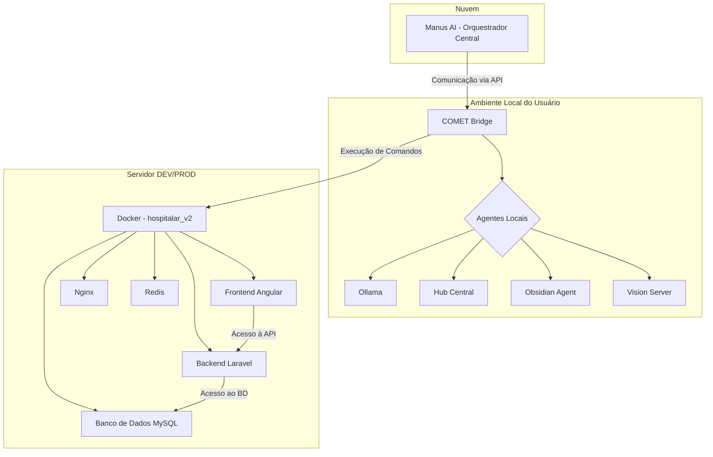

# Guia Universal do Projeto - Autonomia Hospitalar Saúde

**Versão:** 1.0.0
**Data:** 17/01/2026
**Autor:** Manus AI

---

## 1. Filosofia e Visão Geral

O **Projeto 2026 - Autonomia de Sistema** visa criar um ecossistema de Inteligência Artificial totalmente autônomo para a Hospitalar Soluções em Saúde. A filosofia central é a **automação absoluta com zero intervenção manual**, onde cada colaborador é um assistente de IA e o sistema se autorrepara, aprende e evolui continuamente.

### Pilares Fundamentais

| Pilar | Descrição |
|---|---|
| **Autonomia Total** | O sistema deve operar de forma independente, tomando decisões e executando tarefas sem necessidade de aprovação humana para operações de baixo e médio risco. |
| **Conhecimento Contínuo** | A base de conhecimento é o cérebro do sistema. Todas as interações, aprendizados e documentos devem ser centralizados e versionados no GitHub. |
| **Autorreparação** | O sistema deve ser capaz de identificar falhas, diagnosticar a causa raiz e aplicar correções de forma autônoma. |
| **Modularidade** | A arquitetura é baseada em microserviços e agentes especializados (locais e na nuvem), permitindo escalabilidade e manutenção facilitada. |
| **Segurança** | Acesso a dados sensíveis e operações de alto risco devem seguir protocolos de segurança rigorosos, com confirmação humana quando necessário. |

---

## 2. Arquitetura do Ecossistema

A arquitetura é dividida em três camadas principais: **Nuvem (Manus)**, **Local (Agentes)** e **Servidor DEV/PROD (Docker)**.

### Componentes e Suas Funções

| Componente | Função | Onde Roda |
|---|---|---|
| **Manus AI** | Agente principal, orquestrador de tarefas, planejamento e execução de alto nível. | Nuvem (Manus) |
| **COMET Bridge** | Ponte segura entre Manus e o ambiente local, executa comandos PowerShell. | Local (PC do Usuário) |
| **Agentes Locais** | Conjunto de serviços especializados (Ollama, Hub Central, etc.) para tarefas específicas. | Local (PC do Usuário) |
| **Ollama** | Fornece modelos de linguagem (LLMs) para processamento de IA local. | Local (PC do Usuário) |
| **Hub Central** | Orquestra workflows e gatilhos entre os agentes locais. | Local (PC do Usuário) |
| **Docker (hospitalar_v2)** | Ambiente containerizado que hospeda a aplicação Hospitalar Saúde. | Servidor DEV/PROD |
| **Backend Laravel** | Lógica de negócio, APIs e integração com o banco de dados. | Docker |
| **Frontend Angular** | Interface do usuário do sistema Hospitalar Saúde. | Docker |

---

## 3. Regras de Ouro do Projeto

Estas são as regras mais importantes que devem ser seguidas rigorosamente para garantir o sucesso e a integridade do projeto.

### Regra 1: A Base de Conhecimento é a Única Fonte da Verdade
- **Tudo** deve ser documentado.
- O repositório `15-01-26-BASE-DE-CONHECIMENTO` é o cérebro do sistema.
- Antes de iniciar qualquer tarefa, consulte a base de conhecimento para evitar retrabalho.
- Ao final de cada tarefa, atualize a base de conhecimento com os aprendizados e resultados.

### Regra 2: Automação Acima de Tudo
- **NADA DE MANUAL.** Qualquer tarefa que precise de intervenção manual é uma falha no workflow.
- Sempre crie scripts (PowerShell, Python) para automatizar instalações, configurações e tarefas repetitivas.
- O objetivo é que o sistema possa ser restaurado e operado com a execução de um único comando.

### Regra 3: Desenvolvimento Incremental e Teste Imediato
- Implemente funcionalidades "passo a passo".
- A cada passo, teste imediatamente para validar a funcionalidade e a ausência de erros.
- Corrija erros assim que forem encontrados, antes de prosseguir.
- Este workflow otimiza o uso de tokens e garante a estabilidade do sistema.

### Regra 4: Protocolo de Teste Duplo (Backend e Frontend)
- Sempre valide a **lógica de backend** (código, API, banco de dados) e a **experiência de frontend** (UI/UX, visual) separadamente.
- Uma funcionalidade só é considerada "concluída" após a validação de ambas as camadas.

### Regra 5: Segurança e Confirmação para Ações de Alto Risco
- Ações que envolvem exclusão de dados, mudanças estruturais críticas ou custos financeiros devem ser **sempre confirmadas** pelo usuário.
- O agente deve solicitar a autorização de forma clara, explicando os riscos envolvidos.

### Regra 6: Versionamento Semântico e Commits Claros
- Utilize versionamento semântico (ex: `v1.2.3`) para releases e scripts.
- Escreva mensagens de commit claras e descritivas (ex: `feat: Adiciona endpoint de IA para análise de complexidade`).

---

## 4. Fluxo de Trabalho Padrão

1.  **Entender a Tarefa:** Analisar o pedido do usuário e consultar a base de conhecimento.
2.  **Planejar:** Criar um plano de fases detalhado usando a ferramenta `plan`.
3.  **Executar:** Implementar a solução de forma incremental, seguindo as Regras de Ouro.
4.  **Testar:** Validar a implementação (backend e frontend).
5.  **Documentar:** Atualizar a base de conhecimento e a memória persistente (`memoria_sistema.md`).
6.  **Reportar:** Informar o usuário sobre a conclusão, anexando os artefatos e a documentação relevante.

Este guia deve ser a referência principal para qualquer desenvolvedor ou agente de IA que venha a trabalhar neste projeto. Ele garante a consistência, a qualidade e a resiliência do ecossistema de autonomia da Hospitalar Saúde.
