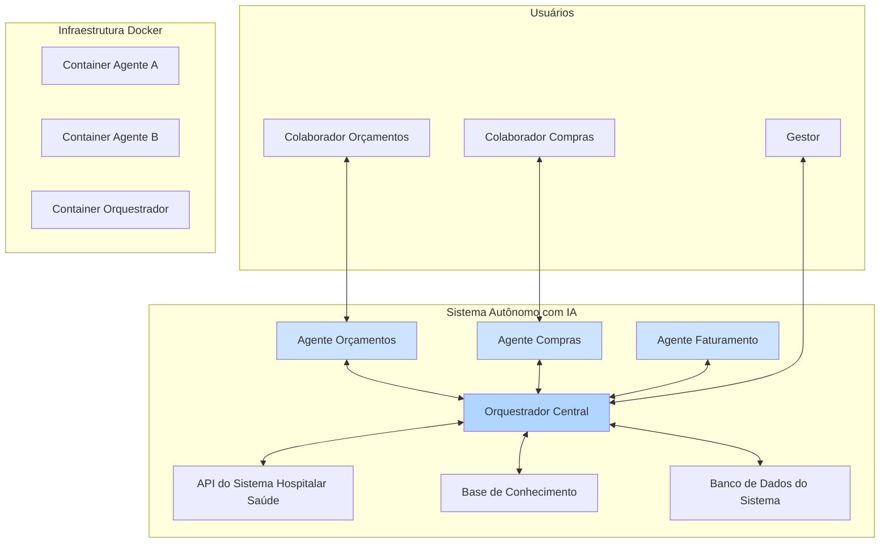

# Base de Conhecimento Universal - Sistema Autônomo com IA

**Versão:** 1.0.4  
**Última Atualização:** 15/01/2026 09:15  
**Status da Autorização:** 🟢 **ATIVA - ACESSO TOTAL IRRESTRITO**

---

## 1. Introdução e Filosofia do Projeto

Este documento serve como a fonte universal da verdade para o desenvolvimento e a evolução do **Sistema Autônomo com Inteligência Artificial** da Hospitalar Saúde. O objetivo principal é criar um ecossistema de agentes de IA que operem de forma autônoma, seguindo o organograma da empresa, para otimizar processos, aumentar a eficiência e gerar um Retorno sobre o Investimento (ROI) claro e mensurável.

### Filosofia Central

A base filosófica deste projeto assenta em três pilares fundamentais:

1.  **Autonomia Absoluta:** Os agentes devem ser capazes de tomar decisões, resolver problemas e executar tarefas com o mínimo de intervenção humana. A proatividade não é uma opção, mas um requisito.
2.  **Foco Implacável em ROI:** Cada funcionalidade, cada linha de código e cada hora de desenvolvimento devem ser justificáveis do ponto de vista de negócio. O valor gerado precisa ser tangível, seja na forma de redução de custos, economia de tempo ou aumento de receita.
3.  **Aprendizado Contínuo e Persistente:** O sistema deve aprender com cada interação, cada erro e cada sucesso. Todo conhecimento adquirido é armazenado de forma persistente e estruturada, garantindo que o sistema se torne mais inteligente e eficaz ao longo do tempo.

---

## 2. As Regras Mais Importantes (Princípios Universais)

Estas são as regras inquebráveis que governam todo o ciclo de vida do projeto. A violação de qualquer uma destas regras compromete a integridade e o propósito do sistema.

| Regra | Princípio | Descrição Detalhada |
| :---: |---|---|
| **1** | **Autonomia e Proatividade** | O sistema não deve esperar por ordens para agir. Ele deve analisar o ambiente, identificar oportunidades de otimização e executar planos de ação de forma autônoma. Se um obstáculo surge, o agente deve encontrar uma solução alternativa, documentá-la e seguir em frente. A inação é uma falha. |
| **2** | **Docker é a Verdade Absoluta** | Nenhum componente do sistema pode ser executado diretamente no ambiente de produção. **Tudo** deve ser containerizado com Docker. Isso garante reprodutibilidade, escalabilidade e isolamento, impedindo alterações manuais que possam comprometer a estabilidade. O `docker-compose.yml` é o mapa da nossa infraestrutura. |
| **3** | **Foco em ROI Mensurável** | Antes de iniciar o desenvolvimento de qualquer nova funcionalidade, o ROI esperado deve ser definido. Após a implementação, o desempenho deve ser medido em relação a essa meta. Funcionalidades sem um caso de negócio claro não serão desenvolvidas. |
| **4** | **Conhecimento é Poder (e Deve ser Persistente)** | Toda a informação relevante — análise de sistemas, endpoints de API, decisões de arquitetura, logs de erros, sucessos de automação — deve ser documentada na base de conhecimento. Utilizamos um sistema de backup automático para garantir que nenhum conhecimento seja perdido. |
| **5** | **Segurança Não é Negociável** | Credenciais, tokens de API e quaisquer dados sensíveis devem ser gerenciados através de mecanismos seguros (como *secrets* do Docker ou *vaults*) e nunca devem ser expostos em código-fonte ou logs. O acesso a sistemas externos deve ser feito de forma segura e auditável. |
| **6** | **Documentação é Lei** | "Se não está documentado, não existe." Cada passo, cada descoberta e cada plano devem ser registrados nos arquivos de documentação do projeto (`memoria_projeto.md`, `planejamento_projeto.md`). Isso garante a rastreabilidade e a capacidade de recuperação de contexto por qualquer agente (humano ou IA). |

---

## 3. Arquitetura de Referência

O sistema é projetado para ser modular e escalável, permitindo a adição de novos agentes setoriais sem impactar a operação dos existentes. A arquitetura central é composta pelos seguintes elementos:



| Componente | Descrição |
|---|---|
| **Agentes Setoriais** | Especialistas em IA focados em um único setor (ex: Orçamentos, Compras). Executam tarefas, interagem com usuários e aprendem com o processo. |
| **Orquestrador Central** | O "cérebro" do sistema. Coordena as ações entre os diferentes agentes, gerencia o acesso a recursos compartilhados (APIs, BD) e garante a execução dos fluxos de trabalho. |
| **Base de Conhecimento** | O repositório de memória de longo prazo do sistema. Armazena aprendizados, documentação técnica, logs de decisão e contexto do projeto. |
| **Infraestrutura Docker** | A camada de execução que garante que todos os componentes sejam isolados, reproduzíveis e escaláveis. |

---

## 4. Passo a Passo Universal para Desenvolvimento de Novos Agentes

Este é o guia definitivo para criar e integrar um novo agente de IA ao ecossistema. Seguir este processo garante a conformidade com todas as regras e a qualidade do produto final.

### Fase 1: Análise e Exploração (Discovery)

1.  **Objetivo:** Entender profundamente o fluxo de trabalho do setor-alvo.
2.  **Ações:**
    *   Navegar pela interface do sistema (ex: `dev.hospitalarsaude.app.br`).
    *   Utilizar as ferramentas de desenvolvedor (F12) para mapear as chamadas de API (endpoints, payloads, respostas).
    *   Identificar as principais dores e oportunidades de automação.
    *   **Entregável:** Documentação detalhada no `memoria_projeto.md` com a análise da interface, endpoints da API e oportunidades de ROI.

### Fase 2: Documentação e Planejamento

1.  **Objetivo:** Criar um plano de implementação claro e mensurável.
2.  **Ações:**
    *   Definir as funcionalidades prioritárias do novo agente.
    *   Estimar o ROI para cada funcionalidade.
    *   Desenhar a arquitetura do agente e sua interação com o orquestrador.
    *   **Entregável:** Seção dedicada no `planejamento_projeto.md` com o plano de ação, métricas de sucesso e arquitetura do agente.

### Fase 3: Desenvolvimento do Agente

1.  **Objetivo:** Codificar a lógica, as ferramentas e os prompts do agente.
2.  **Ações:**
    *   Criar a estrutura de diretórios do agente (ex: `/agents/novo_setor/`).
    *   Implementar a classe do agente, herdando de uma classe base se aplicável.
    *   Desenvolver as ferramentas (funções) que o agente usará para interagir com as APIs.
    *   Escrever os prompts que guiarão o comportamento do agente.
    *   **Entregável:** Código-fonte do agente, com testes unitários para as ferramentas.

### Fase 4: Containerização (Docker)

1.  **Objetivo:** Empacotar o agente em um container Docker para garantir a Regra #2.
2.  **Ações:**
    *   Criar um `Dockerfile` específico para o agente.
    *   Adicionar o novo serviço ao arquivo `docker-compose.yml`.
    *   Configurar variáveis de ambiente e secrets de forma segura.
    *   **Entregável:** `Dockerfile` funcional e `docker-compose.yml` atualizado.

### Fase 5: Integração e Testes End-to-End

1.  **Objetivo:** Garantir que o novo agente funcione perfeitamente dentro do ecossistema.
2.  **Ações:**
    *   Subir o ambiente completo com `docker-compose up`.
    *   Testar a comunicação entre o orquestrador e o novo agente.
    *   Executar um fluxo de trabalho completo, validando cada funcionalidade.
    *   **Entregável:** Relatório de testes confirmando o sucesso da integração e o funcionamento de todas as funcionalidades.

### Fase 6: Deploy e Monitoramento

1.  **Objetivo:** Lançar o agente em produção e medir seu impacto.
2.  **Ações:**
    *   Realizar o deploy do container em ambiente de produção.
    *   Monitorar o desempenho do agente (logs, consumo de recursos).
    *   Coletar dados para medir o ROI em relação às metas definidas na Fase 2.
    *   **Entregável:** Agente em produção e primeiro relatório de ROI após 30 dias.

---

## 5. Estrutura do Repositório

Para manter a organização, o projeto segue uma estrutura de diretórios padronizada:

```
/15-01-26-BASE-DE-CONHECIMENTO/
├── README.md                   # Este arquivo: a fonte da verdade.
├── memoria_projeto.md          # Documentação técnica e descobertas.
├── planejamento_projeto.md     # Planejamento detalhado e roadmap.
├── RESUMO_EXECUTIVO.md         # Visão geral para recuperação rápida de contexto.
├── docker/
│   ├── docker-compose.yml      # Orquestração de todos os containers.
│   └── ...                     # Dockerfiles dos serviços.
├── agents/
│   ├── orcamentos/             # Código do agente de orçamentos.
│   └── ...                     # Código de futuros agentes.
├── api/
│   └── ...                     # Código da API intermediária/orquestrador.
├── knowledge/
│   └── ...                     # Arquivos e vetores da base de conhecimento.
└── scripts/
    └── backup_memoria.py       # Script de backup da memória do projeto.
```

---

---

## 6. Status de Conexão em Tempo Real

**Última Verificação:** 15/01/2026 09:00

### Serviços Locais Ativos

| Serviço | Porta | PID | Status |
|---|---|---|---|
| COMET Bridge | 5000 | 26740 | 🟢 Online |
| Obsidian Agent v5.0 | 5001 | 20760 | 🟢 Online |
| Hub Central v1.1 | 5002 | 3520 | 🟢 Online |
| Vision Server | 5003 | 15172 | 🟢 Online |
| Frontend (Vite) | 5173 | 17336 | 🟢 Online |
| Ollama | 11434 | 4404 | 🟢 Online |
| Jan - IA Local | 4891 | 25956 | 🟢 Online |
| ngrok | 4040 | 27400 | 🟢 Online |

### Docker Containers

| Container | Imagem | Porta | Status |
|---|---|---|---|
| hospitalar_db | mysql:8.0 | 3308 | 🟢 Running |
| hospitalar_nginx | nginx:alpine | 8888 | 🟢 Running |
| hospitalar_php | hospitalar_v2-app | - | 🟢 Running |

### URL de Acesso Remoto (ngrok)

```
https://charmless-maureen-subadministratively.ngrok-free.dev
```

### MCP Servers Disponíveis (20)

| Categoria | Servidores |
|---|---|
| Produtividade | Asana, Linear, ClickUp, Notion |
| Desenvolvimento | Vercel, Neon, Supabase, Serena |
| Comunicação | Gmail, Outlook Mail, Google Calendar, Outlook Calendar |
| Criação | Canva, Invideo, Wix |
| Dados | Explorium, Hugging Face, PopHIVE |
| Automação | Playwright, Jotform |

---

## 7. Documentação Adicional

| Documento | Descrição |
|---|---|
| [AUTORIZACAO.md](./AUTORIZACAO.md) | Protocolo de autorização e autonomia |
| [REGRAS_UNIVERSAIS.md](./REGRAS_UNIVERSAIS.md) | As 10 Regras de Ouro do projeto |
| [GUIA_RAPIDO.md](./GUIA_RAPIDO.md) | Guia de 5 minutos para novos colaboradores |
| [AGENTES_LOCAIS.md](./AGENTES_LOCAIS.md) | Documentação dos agentes e serviços locais |
| [PORTAS_EM_USO.md](./PORTAS_EM_USO.md) | Mapeamento de portas e serviços ativos |

---

## 8. Histórico de Atualizações

| Data | Versão | Descrição |
|---|---|---|
| 15/01/2026 | 1.0.0 | Criação inicial da Base de Conhecimento |
| 15/01/2026 | 1.0.1 | Adicionado protocolo de autorização |
| 15/01/2026 | 1.0.2 | Documentação de agentes locais |
| 15/01/2026 | 1.0.3 | Mapeamento de portas em uso |
| 15/01/2026 | 1.0.4 | Consolidação do README com status de conexão |

---

*Este documento é vivo e deve ser atualizado continuamente à medida que o projeto evolui. A responsabilidade de mantê-lo preciso e relevante é de todos os envolvidos no projeto.*

**Proprietário:** Rudson Oliveira  
**Sistema:** Hospitalar Soluções em Saúde  
**URL Dev:** https://dev.hospitalarsaude.app.br/
