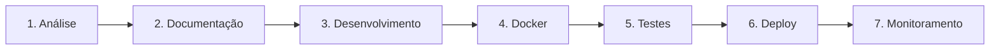

# Regras Universais do Projeto

Este documento contém as regras mais importantes do projeto, organizadas de forma clara e objetiva para consulta rápida. Quando precisar explicar o projeto para alguém, basta consultar este documento.

---

## Índice

1. [Visão Geral do Projeto](#1-visão-geral-do-projeto)
2. [As 10 Regras de Ouro](#2-as-10-regras-de-ouro)
3. [Arquitetura do Sistema](#3-arquitetura-do-sistema)
4. [Fluxo de Desenvolvimento](#4-fluxo-de-desenvolvimento)
5. [Glossário de Termos](#5-glossário-de-termos)
6. [Checklist de Implementação](#6-checklist-de-implementação)

---

## 1. Visão Geral do Projeto

### O Que É?

Um **Sistema Autônomo com Inteligência Artificial** para a Hospitalar Saúde, onde cada setor da empresa terá um agente de IA dedicado que funciona como um assistente virtual inteligente.

### Por Que Estamos Fazendo?

| Problema Atual | Solução Proposta | Resultado Esperado |
|---|---|---|
| Processos manuais lentos | Automação com IA | Redução de 50% no tempo de execução |
| Erros humanos em orçamentos | Validação automática | Redução de 30% nos erros |
| Falta de insights em tempo real | Análise automática de dados | Decisões mais rápidas e assertivas |
| Atendimento lento | Chatbot inteligente | Atendimento 24/7 |

### Qual é o Foco Inicial?

O **Setor de Orçamentos** foi escolhido como piloto porque:
- Tem alto volume de operações
- Impacta diretamente a receita
- Possui processos bem definidos
- Permite medir ROI facilmente

---

## 2. As 10 Regras de Ouro

Estas são as regras inquebráveis do projeto. Memorize-as.

### Regra 1: Docker é Obrigatório

> **"Se não está em Docker, não existe."**

- Todo código deve rodar em containers Docker
- Nenhuma alteração direta no servidor de produção
- O `docker-compose.yml` é o mapa da infraestrutura

**Por quê?** Garante reprodutibilidade, escalabilidade e segurança.

---

### Regra 2: ROI Primeiro

> **"Sem ROI, sem desenvolvimento."**

- Toda funcionalidade precisa de uma justificativa de negócio
- Definir métricas de sucesso ANTES de desenvolver
- Medir resultados DEPOIS de implementar

**Por quê?** O projeto precisa se pagar. Sem ROI, não há sustentabilidade.

---

### Regra 3: Documentação é Lei

> **"Se não está documentado, não aconteceu."**

- Toda descoberta vai para `memoria_projeto.md`
- Todo plano vai para `planejamento_projeto.md`
- Todo aprendizado vai para a base de conhecimento

**Por quê?** Garante continuidade e recuperação de contexto.

---

### Regra 4: Autonomia com Responsabilidade

> **"Agir sem esperar, mas pensar antes de agir."**

- Os agentes devem ser proativos
- Devem resolver problemas sozinhos quando possível
- Mas devem documentar todas as decisões

**Por quê?** Autonomia sem responsabilidade gera caos.

---

### Regra 5: Segurança Não é Negociável

> **"Credenciais expostas = projeto morto."**

- Nunca colocar senhas ou tokens no código
- Usar variáveis de ambiente e secrets
- Auditar acessos regularmente

**Por quê?** Uma falha de segurança pode destruir a confiança e o projeto.

---

### Regra 6: Backup Sempre

> **"Perder conhecimento é perder tempo e dinheiro."**

- Executar backup diário da base de conhecimento
- Manter pelo menos 10 versões anteriores
- Testar restauração periodicamente

**Por quê?** Conhecimento perdido precisa ser reconstruído do zero.

---

### Regra 7: Incremental e Testado

> **"Pequenos passos, grandes resultados."**

- Desenvolver em incrementos pequenos
- Testar cada incremento antes de prosseguir
- Corrigir erros imediatamente

**Por quê?** Erros pequenos são fáceis de corrigir. Erros grandes são caros.

---

### Regra 8: API é o Centro

> **"Tudo se comunica via API."**

- O sistema existente se comunica via API REST
- Os agentes se comunicam via API
- O orquestrador gerencia tudo via API

**Por quê?** APIs permitem integração, escalabilidade e manutenção.

---

### Regra 9: Aprendizado Contínuo

> **"O sistema de hoje deve ser mais inteligente que o de ontem."**

- Registrar cada interação
- Analisar padrões de uso
- Melhorar prompts e lógica baseado em dados

**Por quê?** IA que não aprende é apenas automação burra.

---

### Regra 10: Simplicidade Vence

> **"Se é complicado demais, está errado."**

- Preferir soluções simples e funcionais
- Evitar over-engineering
- Código legível é melhor que código "inteligente"

**Por quê?** Complexidade gera bugs, custos e frustração.

---

## 3. Arquitetura do Sistema

### Diagrama Simplificado

```
┌─────────────────────────────────────────────────────────────┐
│                    SISTEMA AUTÔNOMO                         │
├─────────────────────────────────────────────────────────────┤
│                                                             │
│   ┌─────────────┐    ┌─────────────┐    ┌─────────────┐    │
│   │   AGENTE    │    │   AGENTE    │    │   AGENTE    │    │
│   │ ORÇAMENTOS  │    │   COMPRAS   │    │  FATURAMENTO│    │
│   └──────┬──────┘    └──────┬──────┘    └──────┬──────┘    │
│          │                  │                  │            │
│          └──────────────────┼──────────────────┘            │
│                             │                               │
│                    ┌────────▼────────┐                      │
│                    │   ORQUESTRADOR  │                      │
│                    │     CENTRAL     │                      │
│                    └────────┬────────┘                      │
│                             │                               │
│          ┌──────────────────┼──────────────────┐            │
│          │                  │                  │            │
│   ┌──────▼──────┐    ┌──────▼──────┐    ┌──────▼──────┐    │
│   │   API DO    │    │   BANCO DE  │    │   BASE DE   │    │
│   │   SISTEMA   │    │    DADOS    │    │ CONHECIMENTO│    │
│   └─────────────┘    └─────────────┘    └─────────────┘    │
│                                                             │
└─────────────────────────────────────────────────────────────┘
```

### Componentes Explicados

| Componente | O Que Faz | Tecnologia |
|---|---|---|
| **Agente Setorial** | Executa tarefas específicas de um setor | Python + LangChain |
| **Orquestrador** | Coordena todos os agentes | Python + FastAPI |
| **API do Sistema** | Interface com o sistema existente | REST API |
| **Banco de Dados** | Armazena dados do sistema | Existente |
| **Base de Conhecimento** | Armazena aprendizados | Markdown + Vector DB |

---

## 4. Fluxo de Desenvolvimento

### Passo a Passo para Criar um Novo Agente



| Fase | Duração Estimada | Entregável |
|---|---|---|
| 1. Análise | 1-2 dias | Mapeamento de endpoints e fluxos |
| 2. Documentação | 1 dia | Plano de implementação com ROI |
| 3. Desenvolvimento | 3-5 dias | Código do agente |
| 4. Docker | 1 dia | Dockerfile e docker-compose |
| 5. Testes | 2-3 dias | Relatório de testes |
| 6. Deploy | 1 dia | Agente em produção |
| 7. Monitoramento | Contínuo | Métricas e logs |

---

## 5. Glossário de Termos

| Termo | Definição |
|---|---|
| **Agente** | Um programa de IA que executa tarefas de forma autônoma |
| **Orquestrador** | O componente central que coordena os agentes |
| **ROI** | Retorno sobre Investimento - quanto o projeto gera de valor |
| **Docker** | Tecnologia de containerização que isola aplicações |
| **API** | Interface de Programação de Aplicações - como sistemas se comunicam |
| **JWT** | JSON Web Token - método de autenticação seguro |
| **TUSS** | Terminologia Unificada da Saúde Suplementar - códigos de procedimentos |
| **OPME** | Órteses, Próteses e Materiais Especiais |
| **LangChain** | Framework para desenvolvimento de aplicações com LLMs |
| **Vector DB** | Banco de dados para armazenar embeddings de IA |

---

## 6. Checklist de Implementação

### Antes de Começar um Novo Agente

- [ ] Li e entendi as 10 Regras de Ouro
- [ ] Defini o ROI esperado
- [ ] Mapeei os endpoints da API necessários
- [ ] Documentei o plano no `planejamento_projeto.md`
- [ ] Criei a estrutura de diretórios

### Durante o Desenvolvimento

- [ ] Código está em Docker
- [ ] Credenciais estão em variáveis de ambiente
- [ ] Cada funcionalidade tem testes
- [ ] Documentação está atualizada
- [ ] Commits são frequentes e descritivos

### Antes do Deploy

- [ ] Todos os testes passaram
- [ ] Dockerfile está funcionando
- [ ] docker-compose.yml está atualizado
- [ ] Backup da base de conhecimento foi feito
- [ ] Plano de rollback está definido

### Após o Deploy

- [ ] Monitoramento está ativo
- [ ] Logs estão sendo coletados
- [ ] Métricas de ROI estão sendo medidas
- [ ] Usuários foram treinados
- [ ] Documentação final foi publicada

---

## Conclusão

Este documento é a sua bíblia para o projeto. Quando tiver dúvidas, volte aqui. Quando precisar explicar o projeto para alguém, use este documento como referência.

**Lembre-se:** O sucesso deste projeto depende de seguir estas regras consistentemente. Não há atalhos.

---

*Última atualização: 15/01/2026*
*Autor: Manus AI*
